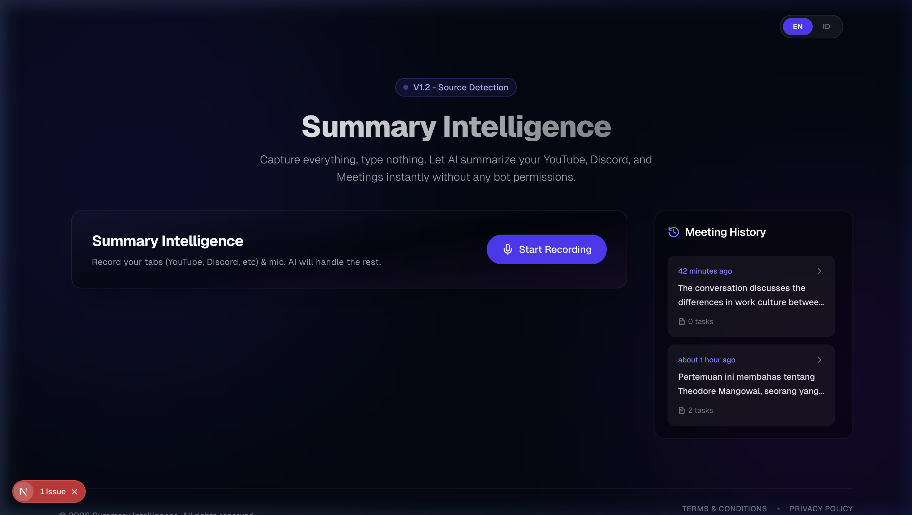
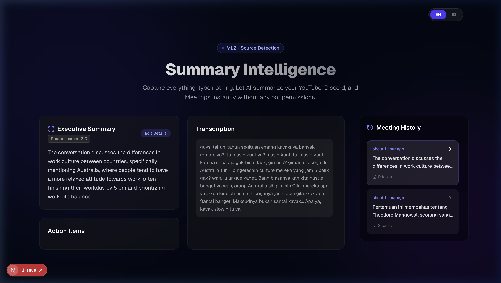
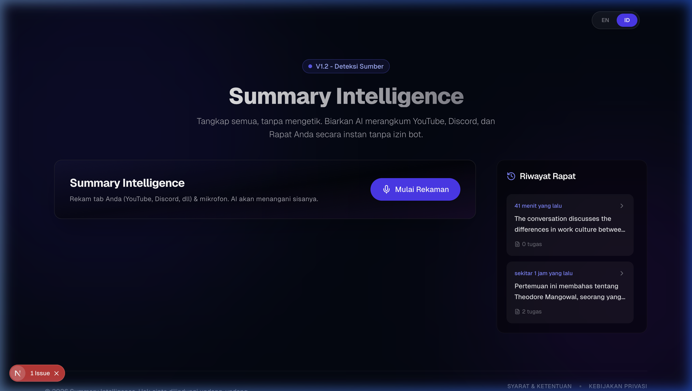

# Summary Intelligence 🧠

**Capture everything, type nothing.** Summary Intelligence is a privacy-first, local-transcription, and AI-powered summarization tool designed to streamline your meetings, YouTube sessions, and Discord conversations.



## 🚀 Key Features

### 🎙️ Instant Recording & Source Detection
Capture audio from your microphone or directly from browser tabs (YouTube, Discord, Google Meet, Zoom) without needing any bot permissions.
- **Smart Detection**: Automatically identifies the source of your recording.
- **Micro-animations**: A smooth, glassmorphic UI that feels alive.

### 📝 AI-Powered Executive Summaries
Get high-quality transcriptions and summaries in seconds.
- **Groq Integration**: Leverages Whisper for lightning-fast transcription and Llama-3 for intelligent summarization.
- **Action Items**: Automatically extracts tasks and follow-ups from your conversations.



### 🌍 Multi-Language Support
Full support for English and Indonesian, including localized summaries and UI.
- **Seamless Toggle**: Switch between languages instantly.
- **Localized AI**: AI processes and summarizes in your preferred language.



### 🔒 Privacy First (Local-Only Storage)
Your data never stays on a central server.
- **IndexedDB Storage**: All meeting history is saved locally in your browser via Dexie.
- **Serverless Processing**: Audio is sent to AI endpoints only for immediate processing and never stored externally.
- **Full Control**: You own your data. Clear your site data to delete everything.

---

## 🛠️ Tech Stack

- **Frontend**: [Next.js 16](https://nextjs.org/) (App Router), [React 19](https://react.dev/)
- **Styling**: [Tailwind CSS 4](https://tailwindcss.com/)
- **Database (Local)**: [Dexie.js](https://dexie.org/) (IndexedDB)
- **Animations**: [Framer Motion](https://www.framer.com/motion/)
- **Icons**: [Lucide React](https://lucide.dev/)
- **AI Backend**: [Groq Cloud](https://groq.com/) (Whisper & Llama-3)

---

## 🚦 Getting Started

1. **Clone the repository**:
   ```bash
   git clone https://github.com/joeinus134131/summary-intelligence.git
   cd summary-intelligence
   ```

2. **Install dependencies**:
   ```bash
   npm install
   ```

3. **Set up environment variables**:
   Create a `.env.local` file with your Groq API key:
   ```env
   GROQ_API_KEY=your_api_key_here
   ```

4. **Run the development server**:
   ```bash
   npm run dev
   ```

5. **Open the app**:
   Navigate to [http://localhost:3000](http://localhost:3000)

---

## 📜 Legal

- [Terms & Conditions](public/images/readme/terms.png)
- [Privacy Policy](public/images/readme/terms.png)

---

## 🤝 Contributing

Contributions are welcome! Please feel free to submit a Pull Request.

---

## 📄 License

This project is licensed under the MIT License - see the LICENSE file for details.

---
Made with ❤️ by [Your Name/Organization]
